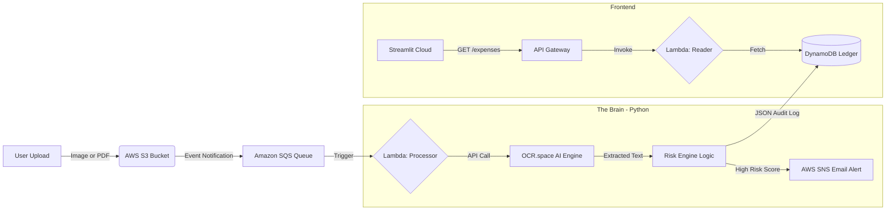

# Bill-E: Serverless AI Audit & Risk Engine
## Cloud-Native Fraud Detection System
*Built with Terraform, AWS Lambda, OCR AI, and Event-Driven Architecture.*


**Bill-E** is an automated, event-driven cloud pipeline designed to audit financial receipts in real-time. It uses **AI (Computer Vision)** to extract text from unstructured images, applies a **Heuristic Risk Engine** to detect fraud (e.g., "Casino", "Alcohol"), and instantly notifies auditors via **Email Alerts** if high-risk items are found.

The entire stack is deployed via **Infrastructure as Code (Terraform)** and visualized on a **Live Streamlit Dashboard**.

---

## Architecture


## Tech Stack
* **IaC:** Terraform

* **Compute:** AWS Lambda (Python 3.9)

* **Orchestration:** Amazon SQS, AWS SNS

* **Database:** DynamoDB (On-Demand)

* **AI/ML:** OCR.space API (Engine 2)

* **Frontend:** Streamlit Community Cloud

## Key Features
* **AI-Powered Analysis:** Integrates OCR (Optical Character Recognition) to extract text from unstructured JPEGs/PNGs, replacing fragile Regex parsing.

* **Real-Time Fraud Detection:** Python-based Risk Engine analyzes receipt text for flagged keywords (e.g., Casino, Alcohol) and assigns a dynamic Risk Score (0-100).

* **"The Snitch" Protocol:** Uses AWS SNS to push immediate email alerts to administrators when high-risk transactions are detected.

*  **Event-Driven & Serverless:** Zero-idle architecture. Uploads trigger S3 → SQS → Lambda workflows, ensuring the system costs $0 when not in use.

*  **Live Audit Dashboard:** A public Streamlit web app that auto-refreshes to show the live audit trail and risk heatmaps.

* **Infrastructure as Code:** 100% of the AWS infrastructure (8+ resources) is provisioned automatically using Terraform.
## Setup & Deployment
**1. Prerequisites**
* AWS CLI configured with credentials.
* Terraform installed.
* OCR.space API Key (Free).

**2. Clone the Repo**

```Bash

git clone https://github.com/Tannishaa/bill-e-audit.git
```
**3. Configure Secrets** Create a terraform/terraform.tfvars file to store your sensitive keys:
```Ini, TOML

ocr_api_key = "YOUR_OCR_KEY"
alert_email = "your.email@example.com"
```
**4. Deploy Infrastructure (Terraform)** 
```Bash
cd terraform
terraform init
terraform apply
# Type 'yes' to confirm
```
**5. Deploy Dashboard**

* Push code to GitHub.

* Connect repo to **Streamlit Community Cloud.**

* Add secrets (API_URL, BUCKET_NAME, AWS_ACCESS_KEY_ID, etc.) in the Streamlit settings.

## Screenshots
