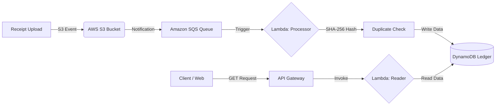

# ☁️ Bill-E: Serverless Event-Driven Audit Pipeline
## Cloud-Native Expense Integrity System
*Built with Terraform, AWS Lambda, and Event-Driven Architecture.*


**Bill-E** is a fully automated, serverless pipeline designed to ingest, validate, and store financial receipts. Unlike traditional scripts, this project uses an **Event-Driven Architecture**: uploading a file to S3 automatically triggers an asynchronous processing workflow involving SQS queuing, Lambda execution, and DynamoDB storage.

It implements **Infrastructure as Code (IaC)** using Terraform, allowing the entire cloud environment to be provisioned or destroyed with a single command.

## Architecture


## Tech Stack
* **Infrastructure as Code: Terraform (State management, Provider configuration).

* **Compute:** AWS Lambda (Serverless Python functions).

* **Orchestration:** Amazon SQS (Decoupled message queuing).

**Storage:** AWS S3 (Object storage) & DynamoDB (NoSQL Ledger).

**API:** AWS API Gateway (HTTP API v2).

**Security:** IAM Roles with least-privilege policies.

## Key Features
* **Event-Driven Architecture:** Fully decoupled pipeline using *AWS SQS* to handle high-concurrency uploads without losing data.

**Infrastructure as Code (IaC):** Entire cloud stack (6+ resources) provisioned automatically using Terraform, ensuring reproducible deployments.

**Data Integrity & Security:** Implements *SHA-256 cryptographic hashing* to generate unique digital fingerprints for every receipt, preventing duplicate uploads and ensuring data consistency.

**Serverless Compute:** Logic runs on *AWS Lambda* (Python 3.9), eliminating the need for always-on servers and reducing costs to near-zero.

**RESTful API Access:** Data is exposed securely via *AWS API Gateway*, allowing frontends to fetch audit logs in real-time.

## Setup & Deployment
**1. Prerequisites**
* AWS CLI configured with credentials.
* Terraform installed.

**2. Clone the Repo**

```Bash

git clone https://github.com/Tannishaa/bill-e-audit.git
```
**3. Deploy Infrastructure (Terraform)** This single command builds the S3 Bucket, SQS Queue, Lambdas, DynamoDB Table, and API Gateway.

```Bash
cd terraform
terraform init
terraform apply
# Type 'yes' to confirm
```
**4. Trigger the Pipeline** Upload a file to the created S3 bucket (check Terraform outputs for the name).

```Bash
# You can use the AWS Console or CLI
aws s3 cp receipt.png s3://bill-e-uploads-xxxx/
```
**5. View Data** Use the API Endpoint output by Terraform to see your processed data JSON.
