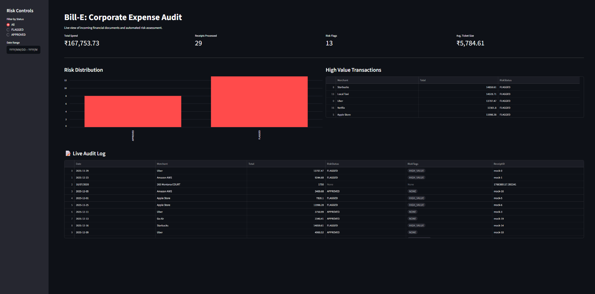
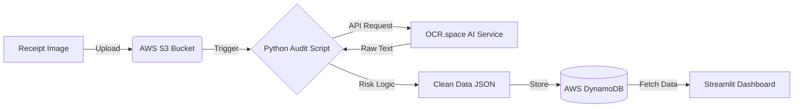

# 🧾 Bill-E: AI-Powered Financial Auditor
## Live Risk Dashboard
*Built with Streamlit to visualize audit logs and flag suspicious transactions in real-time.*




**Bill-E** is a serverless financial pipeline that automates the digitization of physical receipts. It uses **Computer Vision (OCR)** to extract unstructured text, applies a custom **Heuristic Risk Engine** to detect anomalies (like high-value or weekend transactions), and visualizes the audit trail via a real-time **Streamlit Dashboard**.

## Architecture Flow


## Tech Stack
* **Cloud Core:** AWS S3 (Storage), AWS DynamoDB (NoSQL Database)

* **Infrastructure as Code (IaC):** Boto3 (Python SDK) for auto-provisioning resources.

* **AI/ML:** Optical Character Recognition (OCR) via REST API.

* **Language:** Python 3.13 (Regex, Request handling, Pandas).

## Key Features
* **Automated Risk Engine:** Automatically flags suspicious activities like *High Value Transactions (>₹5,000)*, *Non-Compliant Merchants* (e.g., Casinos), and *Weekend Expenses*.
* **Smart Parsing:** Custom heuristic algorithm intelligently distinguishes between "Total Amount", "Phone Numbers", and "Dates" (e.g., distinguishing 2025.00 from $440.00).

* **Live Dashboard:** Interactive UI to monitor total spend, risk distribution, and audit logs in real-time.

* **Auto-Provisioning:** The entire cloud environment is built via code (setup_infra.py), not manually.

## Setup & Installation
**1. Clone the Repo**

```Bash

git clone https://github.com/Tannishaa/bill-e-audit.git
```
2. Initialize Virtual Environment

```Bash
python -m venv venv
# Windows:
.\venv\Scripts\Activate.ps1
# Mac/Linux:
source venv/bin/activate
```
**3. Install Dependencies**

```Bash

pip install -r requirements.txt
```
**4. Configure Secrets:** Create a config.py file in the root directory:

```Python

# config.py
# config.py
BUCKET_NAME = "your-unique-bucket-name"
TABLE_NAME = "ExpenseLedger"
REGION = "ap-south-1"
OCR_API_KEY = "your_ocr_space_key"
```
##  Usage
**Step 1: Build the Cloud Infrastructure:** Run this once to create your S3 Bucket and DynamoDB Table.

```Bash

python setup_infra.py
```
**Step 2: Upload a Receipt:** Place your image as receipt.png and run:

```Bash

python upload.py
```
**Step 3: Run the Audit:** This extracts the data and saves it to the database.

```Bash

python audit.py
```
**Step 4:** Launch the Risk Dashboard View your data and risk alerts in the browser.
```Bash

streamlit run dashboard.py
```

