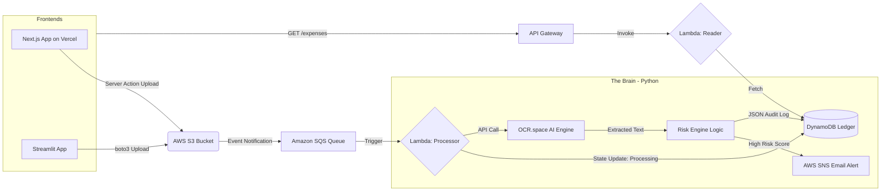
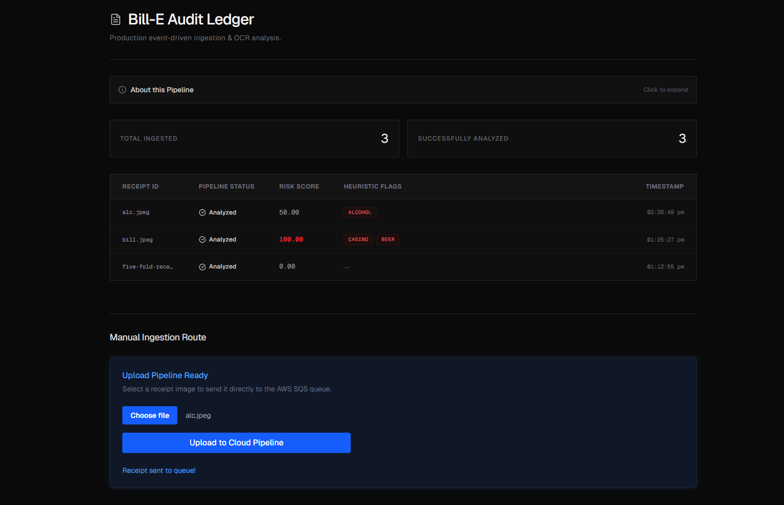

# Bill-E: Serverless AI Audit & Risk Engine
## Cloud-Native Fraud Detection System
*Built with Terraform, AWS Lambda, OCR AI, Next.js, and Event-Driven Architecture.*


**Live Primary Dashboard (Next.js):** [View Live on Vercel](https://bill-e-audit.vercel.app/)
**Bill-E** is an automated, event-driven cloud pipeline designed to audit financial receipts in real-time. It uses **AI (Computer Vision)** to extract text from unstructured images, applies a **Heuristic Risk Engine** to detect fraud (e.g., "Casino", "Alcohol"), and instantly notifies auditors via **Email Alerts** if high-risk items are found.

The entire backend is deployed via **Infrastructure as Code (Terraform)** and visualized on a lightning-fast, zero-cold-start **Next.js Dashboard** (with a secondary legacy Streamlit interface).

---

## Architecture

```mermaid
graph LR
    subgraph Frontends [Frontends]
        Next[Next.js App on Vercel]
        Stream[Streamlit App]
    end

    Next -->|Server Action Upload| S3(AWS S3 Bucket)
    Stream -->|boto3 Upload| S3
    
    S3 -->|Event Notification| SQS[Amazon SQS Queue]
    SQS -->|Trigger| Lambda{Lambda: Processor}
    
    subgraph Brain [The Brain - Python]
        Lambda -->|State Update: Processing| DB
        Lambda -->|API Call| OCR[OCR.space AI Engine]
        OCR -->|Extracted Text| Risk[Risk Engine Logic]
        Risk -- High Risk Score --> SNS[AWS SNS Email Alert]
    end
    
    Risk -->|JSON Audit Log| DB[(DynamoDB Ledger)]
    
    Frontends -->|GET /expenses| API[API Gateway]
    API -->|Invoke| Reader{Lambda: Reader}
    Reader -->|Fetch| DB
```
## Tech Stack
* **Frontend (Primary):** Next.js 15 (App Router), React, Tailwind CSS, deployed on Vercel.
* **Frontend (Legacy):** Streamlit Community Cloud.
* **IaC:** Terraform
* **Compute:** AWS Lambda (Python 3.9)
* **Orchestration:** Amazon SQS, AWS SNS
* **Database:** DynamoDB (On-Demand)
* **AI/ML:** OCR.space API (Engine 2)

## Key Features
* **Zero-Idle-Cost Architecture:** 100% event-driven and serverless. Uploads trigger S3 → SQS → Lambda workflows. When idle, the backend costs $0.

* **Fault-Tolerant Processing:** The Python backend includes robust timeout catching. If the external OCR API fails or rate-limits, the system degrades gracefully, marking the ledger with an Error state instead of failing silently.
* **Live State Tracking:** The Next.js frontend auto-polls the database, displaying granular pipeline states in real-time (Queued → Processing → Analyzed / Error).

*  **AI-Powered Analysis:** Integrates OCR to extract text from unstructured JPEGs/PNGs, replacing fragile Regex parsing.

*  **Real-Time Fraud Detection:** Python-based Risk Engine analyzes receipt text for flagged keywords and assigns a dynamic Risk Score (0-100).

* **"The Snitch" Protocol:** Uses AWS SNS to push immediate email alerts to administrators when high-risk transactions are detected.
* **Infrastructure as Code:** 100% of the AWS infrastructure is provisioned automatically using Terraform.

## Setup & Deployment
**1. Prerequisites**
* AWS CLI configured with credentials.
* Terraform installed.
* OCR.space API Key (Free).
* Node.js & npm installed.

**2. Clone the Repo**

```Bash

git clone https://github.com/Tannishaa/bill-e-audit.git
```
**3. Deploy Backend Infrastructure (Terraform)** Create a terraform/terraform.tfvars file to store your sensitive keys:
```Ini, TOML

ocr_api_key = "YOUR_OCR_KEY"
alert_email = "your.email@example.com"
```
Deploy the stack:
```bash
cd terraform
terraform init
terraform apply
# Type 'yes' to confirm
```
**4. Deploy Next.js Dashboard (Vercel)** 
The modern dashboard is isolated in the bill-e-frontend directory.
 1. Push your repository to GitHub.
 2. Import the project into Vercel
 3. Important: In Vercel's Project Settings, set the Root Directory to bill-e-frontend.
 4. Add the following Environment Variables in Vercel (grab the API endpoint and bucket names from your Terraform outputs):
     * NEXT_PUBLIC_API_URL
     * AWS_REGION
     * AWS_ACCESS_KEY_ID
     * AWS_SECRET_ACCESS_KEY
     * S3_BUCKET_NAME
     * DYNAMODB_TABLE_NAME
5. Click Deploy.

## Screenshots

